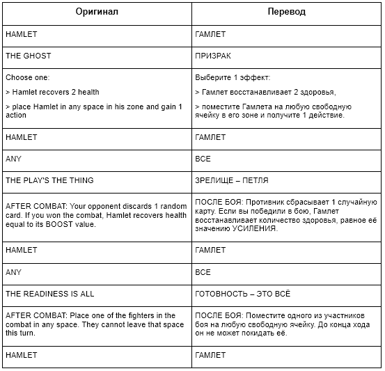
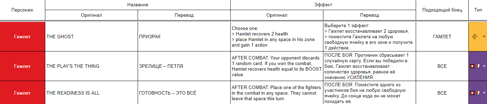
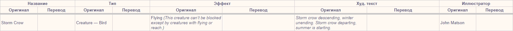

# Что нужно делать?

Переводы карт нужно оформлять не в виде классической билингвальной таблицы:

А в виде таблицы карт, где одной карте соответствует одна строка:

### Исключения

Оформление в виде билингвальной таблицы всё ещё можно использовать в двух случаях:

1. Если во всей переводимой серии игр (то есть базовой игре и всех существующих дополнениях) меньше 20 карт.
2. Или если на картах игры есть только 1 текстовое поле, требующее перевода (см. пояснение далее).

# Как должна быть составлена таблица

## Программа

Для составлении таблицы карт используйте [GoogleSheets](https://docs.google.com/spreadsheets/), Excel или их аналоги. 

> [!NOTE]
> Если по каким-то причинам вам удобнее использовать GoogleDocs или Word со вставкой в них таблицы (аналогично тому, как составляются билингвальные таблицы), то можно выбрать и такой вариант. Но в большинстве случаев с таблицами со множеством столбцов удобнее работать в специализированных программах.

## Структура

Набор столбцов зависит от строения карт конкретной игры. Для каждого отдельного текстового поля карты создаются 2 столбца: с оригинальным текстом и его переводом.

Чтобы разбить карту на текстовые поля, ориентируйтесь на смысловое значение текста: какую роль выполняет та или иная надпись, какую характеристику карты она отображает. Зачастую это разбиение видно визуально: текст разного назначения находится на разных плашках, подложках, в разных местах карты (но это не всегда так).

### Пример

На этой карте 5 текстовых полей, требующих перевода: *название*, *тип*, *эффект*, *худ. текст* и *иллюстратор*.

Несмотря на визуальную близость *эффекта* и *худ. текста*, их назначение сильно отличается (как будет отличаться и подход к их переводу), поэтому они разделены в разные поля.

*Тип* в этой игре состоит из двух частей: типа и подтипа (в примере — Creature и Bird). С точки зрения игровой механики это две отдельные характеристики карты, но весьма близкие по смыслу. В таких случаях можно как разделять их в отдельные поля, так и объединять в одно.

Остальной текст на карте (числовые значения в углах и копирайт внизу) не требует перевода и не добавляются в таблицу.

Для этой игры таблица будет выглядеть так:

# Привести примеры

# Описать преимущества

# Дополнительные советы
